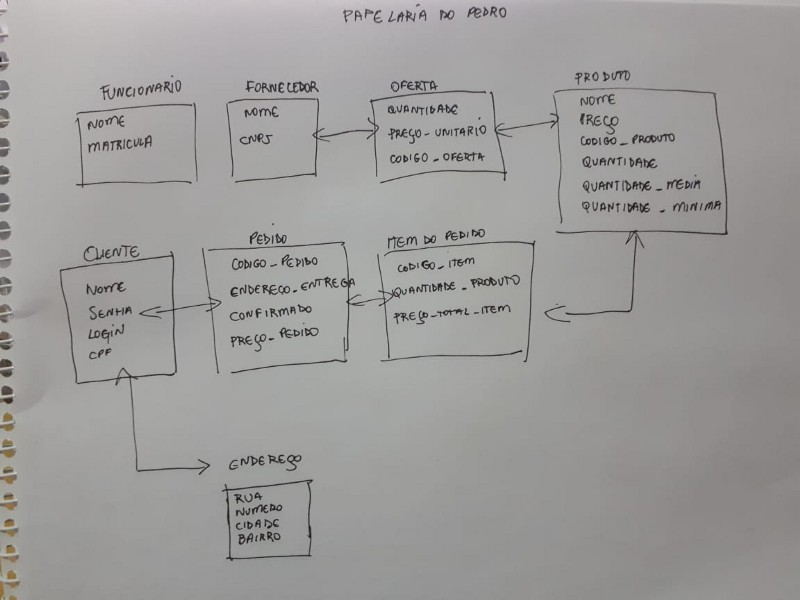

Olá pessoas incríveis da internet, passou-se um tempo desde meu último artigo e como é algo que eu gosto de fazer e compartilhar com vocês, decidi não só voltar a escrever como começar meu projeto sobre arquitetura, que consiste em periodicamente abordarmos assuntos sobre o tema em uma trilha de conhecimento \\o/. Bacana, né? E para começarmos, como este é o primeiro post dessa trilha, vamos começar introduzindo o conceito de arquitetura de software, quem acompanha minhas postagens sabe que uso bastante analogia e não será diferente dessa vez, por isso vou contar uma história que talvez vocês, assim como eu, já viu acontecer ou foi protagonista de algo parecido.

Pedro é dono de uma papelaria e atualmente não tem nenhum sistema que gerencia seus produtos e clientes.

Um dia, cansado de planilhas e papéis, Pedro decidiu procurar Henrique, que é desenvolvedor de software e também seu amigo,para que ele pudesse ajudá-lo a informatizar alguns processos da papelaria. Ao discutirem o que deveria ser feito:

— Henrique, eu não aguento mais lidar com papéis e planilhas, estou perdendo informações importantes e minha cabeça não está lá essas coisas, preciso urgentemente de um sistema onde eu consiga cadastrar e gerenciar a quantidade dos meus produtos, assim como ter acesso às informações dos meus clientes.

— Pedro, eu posso te ajudar a criar um sistema que faz isso e ai te livro dessa parte chata de papéis e planilha, vamos tomar um café e falamos mais sobre isso.

Em um papel de pão o esboço do projeto foi desenhado por Pedro e Henrique:

Em pouco tempo, Henrique concluiu e implementou o sistema, o que ajudou muito Pedro, pois em poucos meses as vendas cresceram e agora ele tinha controle sobre os dados de seus produtos e clientes. Mas Pedro queria poder alavancar ainda mais seu negócio e, conversando com Henrique, deixou claro que agora o objetivo era vender seus produtos pela internet. Ambos novamente esboçaram o que seria uma nova versão do sistema já feito:

— Henrique, estamos em novembro e eu gostaria muito de inaugurar o site em dezembro, assim como fazer as vendas de natal e volta às aulas de janeiro e fevereiro, você acha que nesse prazo de um mês eu consiga ter essa nova versão?

— Claro, Pedro! Farei o possível para entregar no prazo.

Henrique virou noites e noites tentando colocar emenda no sistema que ele tinha criado, os dias foram passando e ele já estava desesperado, Pedro estava cobrando uma posição e Henrique não conseguia entender porque estava tão complexo lidar com o que ele mesmo fez, arruma daqui, quebra de lá e assim foram passando os dias, alguns meses e o sistema que Henrique prometeu estar pronto antes do natal, não estava.

Uma história de dor e sofrimento e é com ela que começamos a nossa introdução do porque é importante falarmos sobre arquitetura de software, a medida que o sistema foi crescendo, a complexidade foi aumentando e foi ficando mais difícil para Henrique terminar o desenvolvimento, esse cenário é bem comum encontrarmos no nosso meio, quem nunca errou? Se olharmos para o contexto em que estamos inseridos, erros são comuns, mas não devem ser normalizados, decisões importantes tomadas no início e no decorrer do caminho são cruciais para evitar falhas, o que tiramos disso é que assim como em qualquer profissão, só vamos progredir aprendendo, com nossos erros ou acertos.

Mas qual a definição de arquitetura de software? Isso faz sentido?

Se pegarmos para ler artigos e livros de grandes arquitetos, como Martin Fowler, podemos ter uma ideia de que arquitetura de software é um termo abstrato e difícil de ser definido, no trecho do livro “[Patterns of Enterprise Application Architecture](https://www.amazon.com.br/Patterns-Enterprise-Application-Architecture-Martin/dp/0321127420/ref=pd_lpo_14_t_0/134-3449811-6133320?_encoding=UTF8&pd_rd_i=0321127420&pd_rd_r=b3263a1f-47a3-42cd-ab41-fe76cb2c04f3&pd_rd_w=EApAi&pd_rd_wg=Qgkeo&pf_rd_p=e7e26e7d-6256-4aae-92f9-7ffa337ed626&pf_rd_r=Q1A9T2TY11SD0GN1EECC&psc=1&refRID=Q1A9T2TY11SD0GN1EECC)”, ele fala:

> ‘**Arquitetura**’ é um termo que muitas pessoas, com pouca concordância entre si, tentam definir. Existem dois elementos comuns: um é a decomposição em alto nível de um sistema em suas partes; o outro são decisões difíceis de alterar. Percebe-se também, cada vez mais, que não há apenas um único modo de especificar a arquitetura de um sistema; ao contrário, existem diversas arquiteturas em um sistema, e a visão do que é significativo em termos de arquitetura pode mudar durante o ciclo de vida de um sistema.

E no final conclui que o pensamento dele foi moldado em uma troca de e-mail com Ralph Johnson:

> **Arquitetura** é sobre coisas **importantes**. **Seja qual for**

Fowler diz também que a base do pensamento arquitetônico é decidir sobre o que é importante e logo mais gastar energia para manter esses elementos, então, se olharmos para a definição dele, Henrique pecou por não perceber isso imediatamente, sistemas com arquitetura ruim são sistemas difíceis de moldar, levando a ter vários defeitos e baixa performance, a visão de Fowler nos deixa claro que a arquitetura são peças difíceis de mudar, mas ele aqui diz sobre a complexidade da mudança.

Em contrapartida, Neal Ford fala:

> A **arquitetura é abstrata até ser operacionalizada.** Em outras palavras, você não pode realmente julgar a viabilidade de longo prazo de qualquer arquitetura até que você não apenas a _implemente_, mas também a _atualize_. E talvez até mesmo tenha conseguido resistir a ocorrências incomuns.

[**Architecture is abstract until operationalized.**  
_Here's a thought experiment. Take a computer, install a mainstream operating system on it, along with various software…_nealford.com](http://nealford.com/memeagora/2015/03/30/architecture_is_abstract_until_operationalized.html "http://nealford.com/memeagora/2015/03/30/architecture_is_abstract_until_operationalized.html")

Se olharmos para o cenário atual de desenvolvimento, onde as mudanças acontecem de forma instantânea, não é possível prever com totalidade os caminhos que é necessário trilhar no planejamento das aplicações.

Voltando a fala de Fowler, podemos ter uma noção do porque ele fala que arquitetura são peças difíceis de mudar, porque isso envolve dinheiro, tempo e as vezes até a remoção de uma arquitetura existente, dando match nas definições de Fowler e Ford, podemos concluir que considerar uma arquitetura para um sistema em sua totalidade antes da implementação, está fora do cenário atual. Quando falamos em arquitetura, não estamos falando em receita de bolo ou algum script onde todas as peças estão engessadas e encaixadas, uma visão arquitetural rica é aquela em que é levado em consideração, arquiteturas escaláveis, novas abordagens e até mesmo novos padrões arquiteturais.

Uma arquitetura bem sucedida sempre será aquela que além de suportar implementações, pode ser atualizada. É complexo ter essa visão ampla em um primeiro momento, e acontece de grandes arquitetos por melhores que eles sejam tomarem decisões erradas, o problema é que a maioria das vezes eles não conseguem retomá-las e as organizações precisam lidar com as consequências.

Por exemplo, se Henrique tivesse orçamento e tempo para repensar na arquitetura o sistema talvez teria sido entregue para Pedro, mas o resultado de ter feito algo complexo e amarrado desde o início resultou em um sistema pouco escalável e defeituoso, por isso, um dos maiores princípios quando falamos em arquitetura de software é a simplicidade, que além do **KISS** (Mantenha Simples, Estúpido) está presente nos 12 princípios do manifesto ágil.

Me lembro de uma vez perguntar para um amigo arquiteto que trabalhava comigo, quais foram os critérios que ele usou para escolher aquela arquitetura para o sistema, ele me disse que o sistema pedia. Tempos depois, precisei refatorar um projeto porque o sistema estava me pedindo, foi então que entendi que um sistema vai sempre passar por mudanças e que nenhuma arquitetura estará sempre atualizada.

Bom, mas se falamos sobre o protagonista da nossa história, ou até sobre nós, “meros desenvolvedores”, como podemos mudar nossas perspectivas e ajudar o sistema a ser melhor projetado? Contribuindo! As habilidades de um arquiteto devem ser desenvolvidas na equipe, senão ficamos a mercê de depositar toda responsabilidade em uma única pessoa, se pensarmos que apesar de não termos todas as habilidades de um arquiteto, ainda conseguimos desempenhar um papel diferente em todas as etapas do projeto, começarmos a entender porque as decisões de design e stacks foram escolhidas, conseguimos ter propósito.

Para concluirmos, por mais que a arquitetura de software seja difícil de definir, o conceito é importante, precisamos pensar mais em como nossos projetos lidam com mudanças a longo prazo e com as situações ocasionais, além disso é importante que a gente procure nos espelhar e buscar ajuda em pessoas que tiveram experiências, tanto para entender a arquitetura, como para termos visão das ações que eles tomaram para chegar àquelas conclusões.

No livro “[Fundamentals of Software Architecture: An Engineering Approach](https://www.amazon.com.br/Fundamentals-Software-Architecture-Neal-Ford/dp/1492043451)’, escrito por Mark Richards e Neal Ford, Richards fala:

> Você tem que ser pragmático, mas visionário

> Você tem que estar no código, mas não pode perder de vista para onde a tecnologia está indo, para onde os negócios estão indo, para onde o projeto está indo e para onde a indústria está indo.

Bom xentiii, o post de hoje termina aqui, mas a boa notícia é que a partir desse artigo virão outros, espero que tenham gostado e até mais!