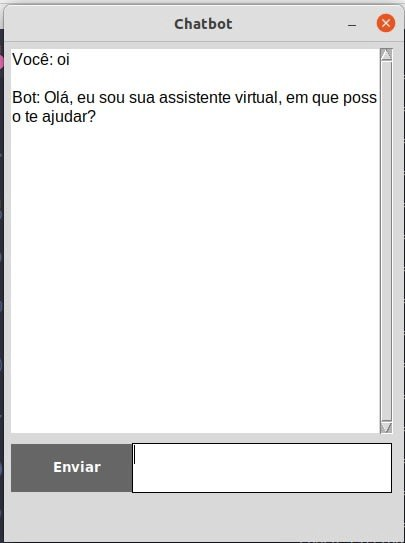

Olá pessoas incríveis desse site, hoje o artigo vai tratar de um assunto que está muito em alta: chatbots!

Para começar, vamos pensar na forma que interagimos com outros seres humanos e o que seria do mundo se não existisse a comunicação. Desde o principio, o homem criou formas de se comunicar com o outro e é o fundamento para a organização das sociedades. Nos últimos tempos o avanço da tecnologia vem afetando a forma como essa comunicação é feita, por exemplo, é tão fácil conversarmos com os outros amigos através de apps de mensagens, não é?  
Esse avanço não só afeta a forma que nos comunicamos com outras pessoas, como também a forma que comunicamos com as máquinas. À medida que avançamos, o modo como comunicamos com os computadores vai se aproximando do natural e é aí que entra o campo de pesquisa computacional chamado PLN (NLP, do inglês Natural Language Processing), ou processamento de linguagem natural.  
Esse campo de pesquisa estuda como fazer a máquina entender a nossa língua escrita, de uma forma que o computador consiga entender a escrita sem conteúdo definido por programadores e vamos fazer essa implementação!


Atualmente existem vários provedores de NLP, os MLaaS, disponíveis para facilitar nossa criação de bots. Talvez vocês tenham ouvido sobre o IBM Watson ou até mesmo o Dialog Flow do Google, são provedores que já fazem de forma profunda esse processamento e são usados por grandes corporações. Nós do **Luizalabs** usamos esses softwares por nos proporcionarem uma comunicação mais humanizada e fluída com o cliente, mas para o pequeno usuário, que talvez queira criar um bot simples ou até mesmo tem curiosidade em como fazer, não seja a melhor escolha, então hoje vou ensinar para vocês como criar um bot simples usando Python e deep learning, o código completo está no meu [Github](https://github.com/thaisribeiro/bot).

### Vamos instalar?

Para começar, é necessário que você tenha uma versão recente do Python e o pip instalados no seu computador, logo mais, vamos instalar as seguintes bibliotecas:

```
pip install nltkpip install numpypip install keraspip install tensorflow
```

*   [NLTK](https://www.nltk.org/) — É uma das ferramentas mais utilizadas para processamento de linguagem natural, foi desenvolvida em Python e tem uma gama muito grande de recursos, como: classificação, tokenização, stemming, tagging, parsing e raciocínio semântico. Todas essas funções são utilizadas para análise de texto;
*   [Numpy](https://numpy.org/) — É uma biblioteca para a linguagem Python com funções para se trabalhar com computação numérica, e que pode realizar operações de álgebra linear de maneira muito eficiente;
*   [Tensorflow](https://www.tensorflow.org/?hl=pt-br) — É uma biblioteca de código aberto criada para aprendizado de máquina, computação numérica e muitas outras tarefas;
*   [Keras](https://keras.io/api/) — Por último, e de extrema importância, usamos o Keras para a estrutura de aprendizado profundo, essa lib poderosíssima é uma das principais APIs de redes neurais de alto nível.

Será interessante vocês lerem como essas bibliotecas funcionam para entender melhor o nosso código, apesar que vou explicando em todo o decorrer da implementação.

Vamos lá então, criaremos nosso dicionário de _intents_, quando falamos em intenções em chatbot, falamos sobre o intuito do usuário ao escrever tal texto. Nosso JSON irá conter a _tag_ que define o que é aquela intenção, os _patterns_ que serão os exemplos de mensagens enviadas, os _responses_ que são os feedbacks enviados pelo bot e o _context_, se quisermos usar manipulação de contexto de mensagens:

```
{  "intents": [    {      "tag": "welcome",      "patterns": ["Oi", "bom dia", "boa tarde", "boa noite", "good morning", "Hi", "hello", "Olá"],      "responses": ["Olá, eu sou sua assistente virtual, em que posso te ajudar?"],      "context": [""]    },    {      "tag": "who_are_you",      "patterns": ["qual seu nome?", "quem é você?", "como você chama?", "nome?"],      "responses": ["Eu sou uma assistente virtual, ainda não tenho nome."],      "context": [""]    },    {      "tag": "love",      "patterns": ["te amo", "linda", "querida", "casa comigo?", "maravilhosa"],      "responses": ["Awwwn, muito obrigada <3"],      "context": [""]    },    {      "tag": "censored",      "patterns": ["feia", "boba", "chata", "vai pro inferno", "puta", "quer casar comigo?", "sua gostosa"],      "responses": ["Não toleramos nenhum tipo de assédio."],      "context": [""]    },    {      "tag": "thanks",      "patterns": ["obrigada", "tks", "thank you", "valeu", "obrigada pela ajuda", "muito obrigada"],      "responses": ["De nada ;)", "Agradeço seu contato, volte sempre!"],      "context": [""]    },    {      "tag": "anything_else",      "patterns": [],      "responses": ["Desculpa, não entendi o que você falou, tente novamente!"],      "context": [""]    }  ]}
```

### Treinando e criando nosso modelo

Agora, vamos criar o arquivo _train.py_, onde vamos ter o código para ler os dados de linguagem natural e usar a rede neural sequencial keras para criar nosso **modelo**.  
Nesse código vamos dividir a explicação em algumas partes, para facilitar o entendimento.  
Realizamos a importação e configuração inicial das libs que iremos utilizar:

```
import jsonimport pickleimport nltkimport randomimport numpy as npfrom nltk.stem import WordNetLemmatizerfrom keras.models import Sequentialfrom keras.layers import Dense, Activation, Dropoutfrom keras.optimizers import SGDnltk.download('punkt')nltk.download('wordnet')lemmatizer = WordNetLemmatizer()
```

Inicializamos a nossa lista de palavras, classes, documentos e definimos quais palavras serão ignoradas, percorremos a nossa lista de intenções, que foram lidas pelo código e com ajuda do nltk fazemos a [tokenização](http://nltk.sourceforge.net/doc/pt-br/tokenize.html) dos patterns e adicionamos na lista de palavras, adicionamos também aos documentos para termos a identificação da tag para cada palavra e adicionamos as tags a nossa lista de classe:

```
# inicializaremos nossa lista de palavras, classes, documentos e # definimos quais palavras serão ignoradaswords = []documents = []intents = json.loads(open('intents.json').read())# adicionamos as tags em nossa lista de classesclasses = [i['tag'] for i in intents['intents']]ignore_words = ["!", "@", "#", "$", "%", "*", "?"]# é feita a leitura do arquivo intents.json e transformado em jsonintents = json.loads(open('intents.json').read())# percorremos nosso array de objetosfor intent in intents['intents']:    for pattern in intent['patterns']:        # com ajuda no nltk fazemos aqui a tokenizaçao dos patterns         # e adicionamos na lista de palavras        word = nltk.word_tokenize(pattern)        words.extend(word)        # adiciona aos documentos para identificarmos a tag para a mesma        documents.append((word, intent['tag']))
```

Em seguida, vamos lematizar, ou seja, transformar as palavras em seus significados básicos, com o objetivo de restringir tudo ao nível mais simples possível.  
Um exemplo de lematização ocorre com verbos, tipo, escrevendo, escreveu e escreve tem o mesmo lema que é escrever.  
Logo, classificamos nossas listas e estamos prontos para construir o modelo de aprendizado profundo.

```
# lematizamos as palavras ignorando os palavras da lista ignore_wordswords = [lemmatizer.lemmatize(w.lower()) for w in words if w not in ignore_words]# classificamos nossas listaswords = sorted(list(set(words)))classes = sorted(list(set(classes)))# salvamos as palavras e classes nos arquivos pklpickle.dump(words, open('words.pkl', 'wb'))pickle.dump(classes, open('classes.pkl', 'wb'))
```

Vamos começar nosso treinamento criando um array vazio de treinamento e criando uma lista de saídas vazias de acordo com o tamanho das nossas classes.  
Percorremos nossos documentos, inicializamos um array de _bag_ vazio, inserimos no nosso _pattern\_word_ a nossa palavra correspondente àquele padrão, lematizamos cada uma delas na tentativa de representar palavras relacionadas, inserimos 1 no bag se a correspondência de palavras for encontrada no pattern atual e utilizamos o _output\_row_ como uma chave para a lista, onde a saída será 0 para cada tag e 1 para a tag atual.  
Após isso embaralhamos nosso conjunto de treinamentos, transformamos em numpy array e definimos uma lista de treinos, sendo x os patterns e y as intenções:

```
# inicializamos o treinamentotraining = []output_empty = [0] * len(classes)for document in documents:    # inicializamos o saco de palavras     bag = []    # listamos as palavras do pattern    pattern_words = document[0]    # lematizamos cada palavra     # na tentativa de representar palavras relacionadas    pattern_words = [lemmatizer.lemmatize( word.lower()) for word in pattern_words]    # criamos nosso conjunto de palavras com 1,     # se a correspondência de palavras for encontrada no padrão     atual    for word in words:        bag.append(1) if word in pattern_words else bag.append(0)    # output_row atuará como uma chave para a lista,     # onde a saida será 0 para cada tag e 1 para a tag atual    output_row = list(output_empty)    output_row[classes.index(document[1])] = 1    training.append([bag, output_row])# embaralhamos nosso conjunto de treinamentos e transformamos em numpy arrayrandom.shuffle(training)training = np.array(training)# criamos lista de treino sendo x os patterns e y as intençõesx = list(training[:, 0])y = list(training[:, 1])
```

Com nossos dados de treinamento prontos, usaremos o modelo de aprendizado profundo keras chamado **sequencial**, esse modelo sequencial é uma das redes neurais mais simples, um perceptron multicamadas, que em particular tem 3 camadas, com a primeira tendo 128 neurônios, a segunda 64 e a terceira tendo o número de intenções igual o número de neurônios, o objetivo dessa rede é tentar prever qual base escolher de acordo com alguns dados.  
Esse modelo será treinado com [descida gradiente estocástica](https://matheusfacure.github.io/2017/02/20/MQO-Gradiente-Descendente/) que é um tópico beeeem complexo, mas que tem muito conteúdo no senhor google e no link disponibilizado.  
Depois que nosso modelo é treinado será salvo no _model.h5_ como numpy array e é com esse modelo que vamos criar nossa GUI do chatbot.

```
# Criamos nosso modelo com 3 camadas. # Primeira camada de 128 neurônios, # segunda camada de 64 neurônios e terceira camada de saída # contém número de neurônios igual ao número de intenções para prever a intenção de saída com softmax
```

```
model = Sequential()model.add(Dense(128, input_shape=(len(x[0]),), activation='relu'))model.add(Dropout(0.5))model.add(Dense(64, activation='relu'))model.add(Dropout(0.5))model.add(Dense(len(y[0]), activation='softmax'))# O modelo é compilado com descida de gradiente estocástica # com gradiente acelerado de Nesterov.# A ideia da otimização do Momentum de Nesterov, ou Nesterov Accelerated Gradient (NAG), # é medir o gradiente da função de custo não na posição local,# mas ligeiramente à frente na direção do momentum. # A única diferença entre a otimização de Momentum é que o gradiente é medido em θ + βm em vez de em θ.
```

```
sgd = SGD(lr=0.01, decay=1e-6, momentum=0.9, nesterov=True)model.compile(loss='categorical_crossentropy',optimizer=sgd, metrics=['accuracy'])# ajustamos e salvamos o modelom = model.fit(np.array(x), np.array(y), epochs=200, batch_size=5, verbose=1)model.save('model.h5', m)print("fim")
```

### Extraindo os dados e criando nossa interface (GUI)

Vamos criar um arquivo _extract.py_ para extrair os dados e lidar com as previsões e probabilidades das mensagens em conjunto com o modelo treinado e um arquivo chamado _bot.py_ que será a nossa interface gráfica.  
Nosso arquivo extract tem 4 funções, sendo essas:

1.  **clear\_writing** que é a responsável por limpar as palavras inseridas, ou seja, fazer a higienização da mensagem enviada pelo usuário
2.  **bag\_of\_words** é a função responsável por criar um pacote de palavras que será usado para as previsões.
3.  **class\_prediction** faz a previsão do pacote de palavras, usamos como limite de erro 0.25 para evitarmos overfitting e classificamos esses resultados por força da probabilidade;
4.  **get\_response** é a função que vamos usar depois que fizermos todo o processo acima, com nosso retorno de intenção, verificamos qual as mensagens de retorno do json, usamos o random para pegarmos apenas uma resposta da lista.

```
import randomimport numpy as npimport pickleimport nltkfrom nltk.stem import WordNetLemmatizerlemmatizer = WordNetLemmatizer()words = pickle.load(open('words.pkl', 'rb'))classes = pickle.load(open('classes.pkl', 'rb'))def clear_writing(writing):    """        Limpa todas as sentenças inseridas.    """    #tokeniza todas as frases inseridas, lematiza cada uma delas e retorna    sentence_words = nltk.word_tokenize(writing)    return [lemmatizer.lemmatize(word.lower()) for word in sentence_words]# retorna 0 ou 1 para cada palavra da bolsa de palavrasdef bag_of_words(writing, words):    """        Pega as sentenças que são limpas e cria um pacote de palavras que são usadas         para classes de previsão que são baseadas nos resultados que obtivemos treinando o modelo.    """    # tokenize the pattern    sentence_words = clear_writing(writing)    # cria uma matriz de N palavras    bag = [0]*len(words)    for setence in sentence_words:        for i, word in enumerate(words):            if word == setence:                # atribui 1 no pacote de palavra se a palavra atual estiver na posição da frase                bag[i] = 1    return(np.array(bag))def class_prediction(writing, model):    """      Faz a previsao do pacote de palavras, usamos como limite de erro 0.25 para evitarmos overfitting      e classificamos esses resultados por força da probabilidade.    """    # filtra as previsões abaixo de um limite 0.25    prevision = bag_of_words(writing, words)    response_prediction = model.predict(np.array([prevision]))[0]    results = [[index, response] for index, response in enumerate(response_prediction) if response > 0.25]        # verifica nas previsões se não há 1 na lista, se não há envia a resposta padrão (anything_else)     # ou se não corresponde a margem de erro    if "1" not in str(prevision) or len(results) == 0 :        results = [[0, response_prediction[0]]]    # classifica por força de probabilidade    results.sort(key=lambda x: x[1], reverse=True)    return [{"intent": classes[r[0]], "probability": str(r[1])} for r in results]def get_response(intents, intents_json):    """        pega a lista gerada e verifica o arquivo json e produz a maior parte das respostas com a maior probabilidade.    """    tag = intents[0]['intent']    list_of_intents = intents_json['intents']    for idx in list_of_intents:        if idx['tag'] == tag:            # caso as respostas sejam um array contendo mais de uma,             # usamos a função de random para pegar uma resposta randomica da nossa lista            result = random.choice(idx['responses'])            break    return result
```

Por fim, vamos criar nossa interface gráfica utilizando o módulo [tkinter](https://docs.python.org/3/library/tkinter.html) do Python, que é um toolkit padrão para criação de GUI. Para não extender muito e visto que esse módulo tem uma documentação muito boa, vou deixar o código com os comentários do que fiz para criar a interface:

```
import jsonimport tkinterfrom tkinter import *from extract import class_prediction, get_responsefrom keras.models import load_model# extraimos o modelo usando o kerasmodel = load_model('model.h5')# carregamos nossas intençõesintents = json.loads(open('intents.json').read())base = Tk()base.title("Chatbot")base.geometry("400x500") base.resizable(width=FALSE, height=FALSE)def chatbot_response(msg):    """        Resposta do bot    """    ints = class_prediction(msg, model)    res = get_response(ints, intents)    return resdef send():    """        Envia a mensagem    """    msg = EntryBox.get("1.0", 'end-1c').strip()    EntryBox.delete("0.0", END)    if msg != '':        Chat.config(state=NORMAL)        Chat.insert(END, f"Você: {msg}\n\n")        Chat.config(foreground="#000000", font=("Arial", 12))        response = chatbot_response(msg)        Chat.insert(END, f"Bot: {response}\n\n")        Chat.config(state=DISABLED)        Chat.yview(END)# Cria a janela do chatChat = Text(base, bd=0, bg="white", height="8", width="50", font="Arial",)Chat.config(state=DISABLED)# Vincula a barra de rolagem à janela de bate-paposcrollbar = Scrollbar(base, command=Chat.yview)Chat['yscrollcommand'] = scrollbar.set# Cria o botão de envio de mensagem, onde o comando envia para a função de sendSendButton = Button(base, font=("Verdana", 10, 'bold'), text="Enviar", width="12", height=2, bd=0, bg="#666", activebackground="#333", fg='#ffffff', command=send)# Cria o box de textoEntryBox = Text(base, bd=0, bg="white", width="29", height="2", font="Arial")# Coloca todos os componentes na telascrollbar.place(x=376, y=6, height=386)Chat.place(x=6, y=6, height=386, width=370)EntryBox.place(x=128, y=401, height=50, width=260)SendButton.place(x=6, y=401, height=50)base.mainloop()
```

### Executando nosso código

Antes de executar nosso código, vamos criar 3 arquivos na raiz do projeto _model.h5_, _words.pkl_ e _classes.pkl_. Se você usa Windows, terá que instalar um servidor chamado Xming.

Vamos começar treinando nosso modelo e depois de treinado executamos nosso _bot.py_

```
python train.py
```


```
python bot.py
```



Bom, concluímos aqui nosso primeiro chatbot e estou feliz de poder compartilhar com vocês. Esse projeto por mais simples que seja nos dá habilidades úteis para a ciência de dados, claro que tem muito chão para entendermos aprendizado profundo, mas estamos no caminho.

Gostou? Então reage ao post e compartilhe com seus amigos para que eu continue trazendo conteúdo interessantes para vocês!