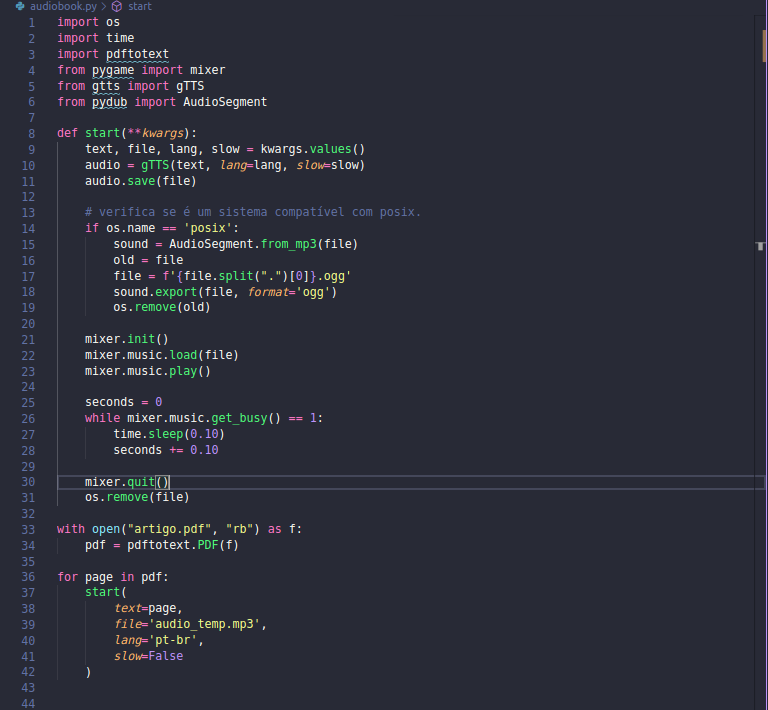

Há um tempo atrás ensinei no twitter como converter um pdf em um audiobook, foi na época das minhas férias em que eu estava com preguiça de ler alguns artigos e também queria estudar, trouxe para cá o que fiz lá, e vou explicar como fazer essa conversão de forma simples.

Primeiro, vamos começar instalando as libs que vamos precisar:


```
pip install pdftotext
pip install gtts
pip install pygame
pip install pydub
```
Primeiro criei uma função de start, que será a responsável por ler o texto que estou enviando, criar um arquivo temporário e dar start no texto.
A lib gTTS converte a string de texto que passamos em parâmetro de voz e salva em um arquivo, com o nome que passarmos.

Se o sistema operacional for compatível com posix, no caso de linux e MacOS, vamos manipular esse arquivo temporário com ajuda da lib _pydub_, e criaremos então um arquivo com extensão .ogg. Apagamos o arquivo antigo, ai que entra a mágica, agora com ajuda do mixer do _pygame_ iniciamos o play do áudio, usamos o getbusy dentro de um loop para identificarmos se o áudio está sendo executado a cada 10 segundos, antes de finalizarmos com o mixer.quit e removermos o arquivo, fazendo isso, garantimos que o áudio seja tocado por completo antes de ser deletado.

Fora da função vamos criar nosso run inicial, e agora que entra o pdf, com ajuda do _pdftotext_, conseguimos transformar um pdf em texto, usei o open para abrir o arquivo em questão e com ajuda de um laço, já que meu pdf pode ter várias páginas, passo o texto transformado (page) e os outros atributos usados para dentro da função start.




Para executar, só rodarmos no terminal _python nome_do_arquivo.py_ e ouvirmos o audiobook.

Caso a saída de voz não funcione, faça a seguinte instalação:

```
  sudo apt update && sudo apt install espeak ffmpeg libespeak1
```

O Códígo completo está [aqui](https://replit.com/@ThaisRibeiro3/audiobook)!
