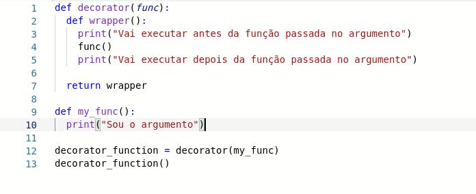
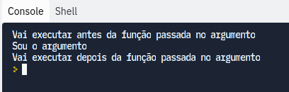
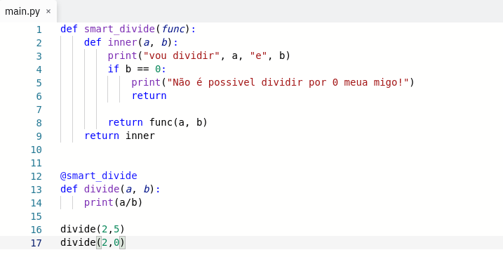

Oi gente linda, tudo bem? Esse é mais uma thread que fiz no twitter e que trouxe para cá, afim de centralizar o que tenho falado.
E a bola da vez são as dicas de python que fez sucesso na rede do passarinho azul.

Vocês sabiam que python é mais ensinado em escola que o idioma francês? Python é uma das linguagens de programação mais usadas no mundo, porém, quem é "pythonista" sabe que temos uma grande desvantagem em velocidade, por isso eu pretendo te ajudar a melhorar a performance do código e o tornálo-lo supimpa:

### Use a estrutura de dados adequada
Isso tem efeito significativo no tempo de execução do seu script, em python, temos 4 estruturas integradas: tupla, lista, dict e conjuntos, mas a maioria de nós usamos apenas listas em todos os casos. 

O certo é prestarmos atenção e usarmos a estrutura adequada para cada caso:
Um exemplo, se executarmos o código abaixo, vamos ver a rapidez que uma tupla executa uma operação de recuperação simples, diferente da lista.

```python
import dis

def tupla():
  _tupla = (1,2,3,4,5,6,7,8)
  print(_tupla[6])

def lista():
  _lista = [1,2,3,4,5,6,7,8]
  print(_lista[6])


print("=============Lista=============")
dis.dis(lista)
print("=============Tupla=============")
dis.dis(tupla)
```
O módulo dis, desmonta o código byte, que vocês podem saber mais sobre aqui: https://acervolima.com/desconstruindo-o-interprete-nocoes-basicas-sobre-o-bytecode-python/

### Reduzindo a pegada de memória
uando falamos em pegada, nos referimos à memória ocupada por um objeto, para o código rodar mais rápido é interessante reduzir essa pegada, por exemplo, temos o código:

```python
msg = 'Eu gosto'
msg += 'de python.'
msg += 'É sobre isso'
```

Podemos substituir por um código mais simples e com menos uso de memória, que nesse caso, evitamos o uso do + entre as strings e usamos f-strings:

```python
msg = ['Eu gosto', 'de python.', 'É sobre isso']
'\n'.join(msg)
```

###  Uso de compreensão de listas
Para substituir "for" e "while", ela é mais rápida porque é otimizada para o interpretador Python detectar um padrão previsível durante o loop e como bônus ela é mais legível e economiza uma variavel extra na contagem:
```python
# O BOM

lista = [i for i in range(10) if i%2 == 0]
print(lista)

output: [0,2,4,6,8]

# O NÃO TÃO BOM ASSIM

i = 0
lista = []
while i < 10:
    if i%2 == 10:
        lista.append(i)
print(lista)

output: [0,2,4,6,8]
```
### Uso de enumerate()
Uso de enumerate() nas listas, ele adiciona um counter a um iterável e o retorna, assim fica mais fácil termos os index:

Ex:

```python
lista = ['gato', 'cao', 'ave']
for item in enumerate(lista):
    print(item)

output: (0, 'gato')
              (1, 'cao')
              (2, 'ave')

for index, item in enumerate(lista):
    print(count, item)

# output: 0, gato
#        1, cao
#        2, ave
```

### Strings de concatenação
Use strings de concatenação, você poderia fazer isso usando um "for", mas seria ineficiente e em especial se a lista for longa, em python as strings são imutáveis, portanto teriam que ser copiadas para outra variável para concatenar, usando join() temos uma abordagem melhor.

Ex.:

```python
letras = ['p','y','t','h','o','n']
palavra = ''.join(letras)
print(palavra)

# output: python
```

### Repetir Strings
Para repetir strings, faça:
```python
x = 'V' * 5
print(x)

# output: VVVVV
```

### Fatiar strings
Faça:
```python
x = 'abc' 
print(x[:2]) # output: ab
print(x[1:]) # output: bc
print(x[:-2]) # output: a
print(x[-2:]) # output: bc
```

### Inverter Strings
Faça:
```python
x = 'python' 
print(x[::- 1])
# output: nohtyp
```
### Obter o que é igual e diferente em dois conjuntos
Faça:

```python
a = {1,2,3}
b = {3,4,5}
# o que tem de comum
print(a.intersection(b))
# output: {3}

# o que tem de diferente
print(a.difference(b))
# output: {1,2}
```
### Une dois conjuntos sem repetir o que tem de comum
Faça:

```python
a = {1,2,3}
b = {2,3,4,5}
print(a.union(b))
# output: {1, 2, 3, 4, 5}
```

### Argumentos opcionais
Argumentos opcionais, assim como em Javascript e outras linguagens também está disponível em python, para isso faça:

```python
def root(my_var='default'):
    print(my_var)

# output:  default
```

### Use decorators
Decoradores podem adicionar funcionalidade ao código, porque eles são métodos usados para envolver uma função e modificar seu comportamento, vamos a um exemplo para entender melhor o que seria isso:
Ex:
assim, adicionamos qualquer comportamento antes e depois da execução de uma função qualquer




Agora vamos usar de fato o decorator em uma função útil:


### Lambda
Usem lambda, enquanto as funções normais são definidas em python usando a palavra-chave "def", funções anônimas são definidas usando a palavra "lambda", vamos ver um exemplo do porque utilizá-las.

```python
Ex:
# O BOM
def foo(x, y):
    return x + y

print(foo(1,3))
#output: 4

# O ÓTIMO
# lembra os arrows functions, mas só lembra
foo = lambda x, y : x + y

print(foo(1,3))
#output: 4
```

### Lista em Python é matriz...
Sim, em python uma lista não é implementada como lista comum de link único que aprendemos em Estrutura de Dados, a lista em Python é um array, ou seja, você pode recuperar um elemento em uma lista usando um índice com tempo constante sem pesquisar desde o ínicio da lista. 

Logo, um dev Python deve pensar por um momento ao usar o insert(), por exemplo, ao fazer list.insert(0, element) não será eficiente para inserir um elemento na frente, porque todos os indices subjacentes da lista serão alterados.

Mas, é possível anexar um elemento no fim da lista usando append(), escolha deque, no entanto, se quiser inserção ou remoção rapida em ambas as extremidades, é rápido porque deque é implementado como uma lista duplamente vinculada.

### ZIP em listas
Use ZIP ao trabalhar com listas, se quiser juntar várias listas com o mesmo comprimento e imprimir o resultado, a melhor maneira é usar zip().

Ex.:
```python
tipos = ['ave', 'felino']
animais = ['rolinha', 'gato']
for tipo, animal in zip(tipos, animais):
    print(tipo, animal)

#output: ave, rolinha
#        felino, gato
```

### Use collections
Coleções em python são tipos de dados de contêiner, ou seja, listas, conjuntos, tuplas, dicionários. O módulo de coleções fornece tipos de dados de alto desempenho e existem várias funções fornecidas por esse módulo, nesse caso vamos usar a Counter().

```python
from collections import Counter
contagem = Counter(['a','b','c','d','b','c','d','b'])
print(contagem) 
#output: Counter({'b': 3, 'c': 2, 'd': 2, 'a': 1})
```

### Pesquise sobre libs antes de implementar
Pesquisando sobre bibliotecas e funções antes de implementar a sua própria, porque python tem uma grande quantidade de libs e funções integradas para nos ajudar a escrever funções, basta pesquisarmos e evitarmos insultarmos a linguagem e refazermos coisas existentes.
Pode-se verificar uma lista de libs nos docs oficiais: https://docs.python.org/3/library/

### Evite variáveis globais desnecessárias
Python acessa variáveis locais com + eficiência que variáveis globais, uma vez que uma variável global é definida, permanece até que o programa completo seja compilado, ocupando espaço na memória o tempo todo.

Exemplo para evitar:
```python
a = 2
b = 8
def foo():
  sum = a + b
  return sum
```

Para copiar:
```python
def foo():
  a = 2
  b = 8
  return a + b
``` 

Por hoje é isso ;)
