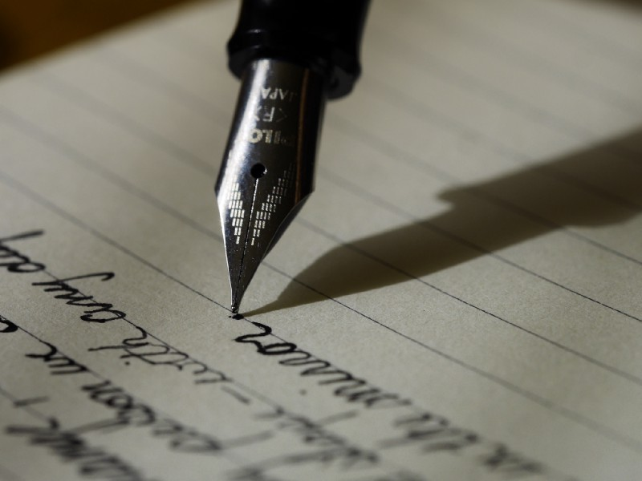
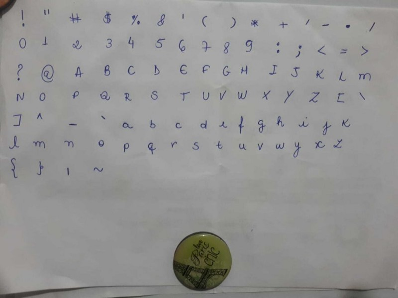
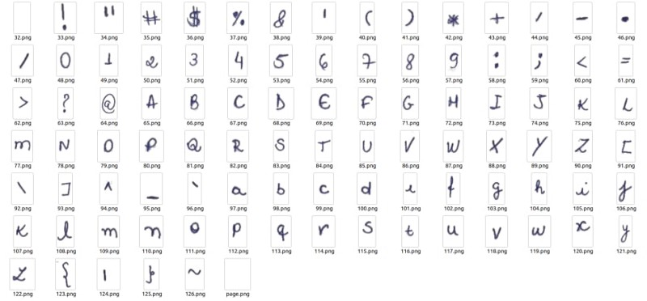

Olá pessoas incríveis da internet, se você, assim como eu já passou por situações em que precisava assinar um documento online, enviar uma assinatura, escrever uma carta para o sindicato ou fazer uma tarefa de escola que o professor exige que seja feita à mão, hoje é seu dia de aprender a fazer o computador te ajudar (ou não).

#### O que vamos precisar?

Primeiro, vamos criar nosso modelo, queremos que seja com nossa caligrafia, então o que eu fiz e acho que vocês podem fazer de uma forma melhor? Escrevi em um papel branco todas as letras correspondentes a tabela [Ascii](https://www.matematica.pt/util/resumos/tabela-ascii.php):



Desde já peço desculpa pela péssima foto que dificultou um pouco, então sugiro que vocês façam em um papel em branco e melhore a qualidade da imagem. Agora vamos cortar/tirar print de cada carácter, renomear com seu respectivo código da tabela Ascii e salvar em uma pasta dentro do seu projeto.



Com nosso modelo pronto, chegou a hora de programarmos o script, que é muito simples,vamos usar a biblioteca **PIL**, que é uma biblioteca de código aberto do python que nos dá suporte para abrir, manipular e salvar alguns formatos de arquivos de imagens e também usaremos a biblioteca unicode, para removermos acentos do nosso texto de entrada.

`pip install unidecode`

```
from PIL import Imagefrom unidecode import unidecode
```

Vamos pensar em uma página, na verdade vamos usar uma página em branco onde vamos gravar nosso texto (mas podem usar a que quiserem) em forma de imagem, pensando em questão de altura e largura da mesma, temos os eixos x e y, devido a isso, vamos iniciar esses eixos nas posições 0.

```
input_text = open('text.txt').read()# caminho da imagem onde vamos escrever nosso textobackground = Image.open('hand_fonts/page.png')x, y = 0, 0
```

Feito isso, vamos percorrer cada caractere do nosso texto de entrada. A função **ord** produz o número correspondente ao ascii do item iterado e é ai que a mágica acontece, vamos associar esse número com a imagem correspondente da nossa fonte que salvamos na pasta _hand\_fonts_.  
Para finalizarmos, aplicamos algumas regras finais onde verificamos se a largura da linha não está excedendo a largura da página, e se não há quebra de linha, se sim, acrescentamos ao eixo y 140px, que pode variar dependendo da sua necessidade e do tamanho da imagem escolhida.

```
for text in unidecode(input_text):    # verifica se tem quebra de linha e atualiza o eixo y,     # acrescentando 140px para a proxima linha    if ord(text) == 10:      print('Entrou?')      x = 0      y += 140      continue
```

```
    # vamos usar a função ord que irá reproduzir    # o respectivo código Ascii do nosso item e converter em string    ascii_current = str(ord(text))    try:      font = Image.open(f'hand_fonts/{ascii_current}.png')    except:       continue
```

```
    # atualiza a pagina em branco que escolhemos    background.paste(font, (x, y))
```

```
    x += font.width
```

```
    # verificamos se a largura da linha está     # excedendo a largura da página, se sim,     # vamos para a próxima linha adicionando 140 px na variável y    if background.width < x or len(text) * 115 > (background.width - x):        x = 0        y += 140
```

```
background.show()
```

E por hoje é só, gostou? Compartilha com seus amigos e me siga no [twitter](https://twitter.com/thaisplicandoo) que sempre trago assuntos relevantes para lá.

Obrigada, e até a próxima!

[Repositório](https://github.com/thaisribeiro/carteiro)