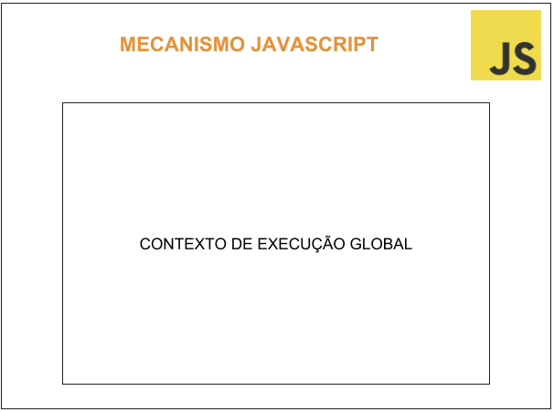
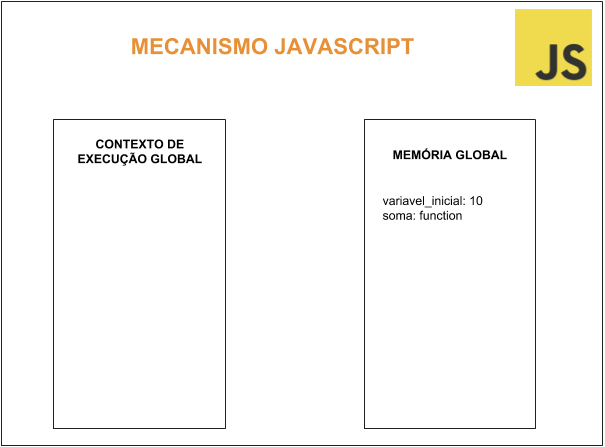
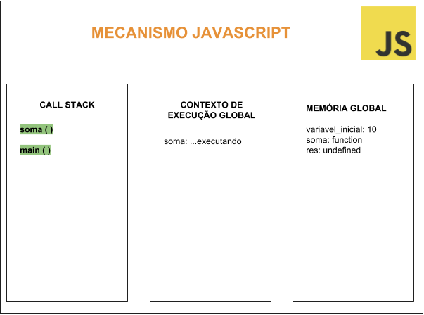

Olá pessoas incríveis da internet, vocês sabem me dizer como o mecanismo Javascript funciona? Bom, nem eu sabia e me despertou essa curiosidade de ir mais a fundo e entender como é executado o que escrevemos. Vem comigo?

Primeiro, mecanismo Javascript é um programa ou interprete que executa o código Javascript.

Existem vários pilares na programação Javascript para que nos tornemos desenvolvedores melhores, para isso temos que ir além do básico e o primeiro e importante tópico para entendermos todo o resto é saber como funciona o que executamos.

Como o Javascript executa meu código?

Toda vez que o Javascript é executado ele passa por uma série de etapas, vamos começar pela de criação de um contexto global.

Atualmente existem dois motores proeminentes, o V8 e SpiderMonkey, V8 é o mecanismo Javascript de código aberto do Google e do Node.js e o SpiderMonkey é o mecanismo da Mozilla, usado no Firefox, vamos entender como esses motores funcionam, como disse que iriamos começar pelo contexto de execução global temos que entender o que é isso, contexto de execução é um nome bonito para descrever o ambiente no qual o seu código Javascript é executado, com algumas imagens vou tentar deixar isso mais claro, taokei?

Imagine o mecanismo como se fosse uma caixa:



Agora vamos analisar esse código aqui:

```
var variavel_inicial = 10;

function soma(variavel_inicial){
  return variavel_inicial + 10;
}
```

Sabem me dizer como o mecanismo lê? Tempo…


Bom vamos lá, eu to aprendendo com vocês por isso busquei saber haha.

```
Eu sou o mecanismo, beleza? Eu vou ler seu código lá de cima jovem.

Primeira linha: Existe uma váriavel aqui, vou armazenar na memória global

Terceira linha: Aqui temos uma declaração de função, vou armazenar na memória global também

Pronto! terminei por aqui.
```

A forma que o motor vê o seu código é meio que de cima para baixo, mas percebe-se que ele não executa a função? Pois é uma declaração de função e não uma chamada, o motor vai traduzir em alguns valores e armazenar na memória global, vai ficar assim:



Agora vamos seguir no nosso quebra-cabeça, como esse contexto de execução e a memória global se encaixam?

Relembrando o código:

```
var variavel_inicial = 10;

function soma(variavel_inicial){
  return variavel_inicial + 10;
}
```

Até aqui vimos como o motor vê o código, certo? Só que se agora eu chamar a função “soma”, o que acontece? O ato de chamar uma função faz com que o motor peça ajuda e ai entra nossa pilha de chamada (call stack), o que é o call stack? de onde veio? o que fazem? Você não vai descobrir na sexta-feira no Globo Repórter, vai ser hoje e agora!

Call stack é como se fosse um log que fica de olho no que esta acontecendo, o nome já deixa claro que é uma pilha, como em estrutura de dados e funciona com push e pop, vou ser mais clara, quando é executada uma função Javascript, o mecanismo envia essa função para o call stack e cada CHAMADA é inserida nessa pilha.

A primeira coisa que é empurrada é o main() ou o global(), o principal thread de execução do programa.

Voltamos a desenhar:



Olha ai que gracinha, a trilha de execução no call stack, se entramos na função, nós a colocamos no topo da pilha, se retornamos da função, saímos do topo da pilha

Sabemos então que o mecanismo Javascript cria um contexto global e uma memória global, quando alguém chama uma função o mecanismo pede ajuda ao call stack que mantém a trilha de qual função está sendo chamada, a função aparece no contexto global, mas temos algo faltando ali…

O que ta faltando é chamado de contexto de execução local, observe que na caixinha de memória global apareceu a variável “res”, essas variáveis tem um valor indefinido no início, então assim que aparecer soma ou a função no contexto de execução global, a função é executada e a variável “res” recebe o seu valor de retorno, durante essa fase de execução, um contexto de execução local é criado para manter as variáveis locais.

Deu para visualizar o que que aconteceu nessas 4 linhas de código?

O mecanismo Javascript criou um contexto de execução, uma memória global e uma pilha de chamadas (call stack), quando chamamos a função, o mecanismo criou um contexto de execução local que possui uma memória local, entendendo isso é possível entender o porque Javascript é single-thread, assíncrono e o porque precisamos de callbacks.

Vamos detalhar isso:

O Javascript é single-thread , ou seja, tem uma só pilha de chamadas, faz uma coisa de cada vez, mas o que acontece quando as coisas estão lentas?

Rodar em uma única thread é bastante limitante, quando a pilha de chamadas tem funções para executar, o navegador não pode fazer mais nada, fica bloqueado e isso causa problema nos aplicativos e esse não é o único problema, o Chrome por exemplo tem um limite de pilha de 16000 quadros, mais do que isso ele levanta um erro que talvez já tenhamos visto por ai e pergunta se deseja que a página seja encerrada.


Não é a melhor experiencia do usuário né nom?

Como resolver isso Thais? Bem, a solução é callbacks assíncronos, eu vou explicar melhor sobre em outra postagem, fiquem ligados.

Saiu!!! Vem ver: [Você já se perguntou como o Javascript funciona? EventLoop, Filas e Programação Assíncrona](https://medium.com/pequenos-passos-de-m%C3%A3os-dadas-comigo/voc%C3%AA-j%C3%A1-se-perguntou-como-o-javascript-funciona-eventloop-filas-e-programa%C3%A7%C3%A3o-ass%C3%ADncrona-66aaf4552752)


