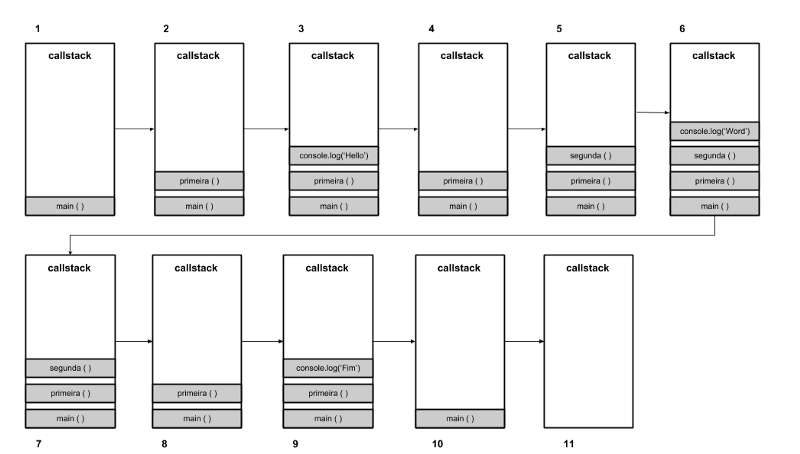
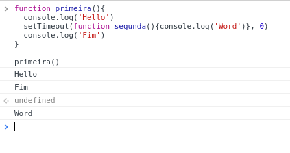
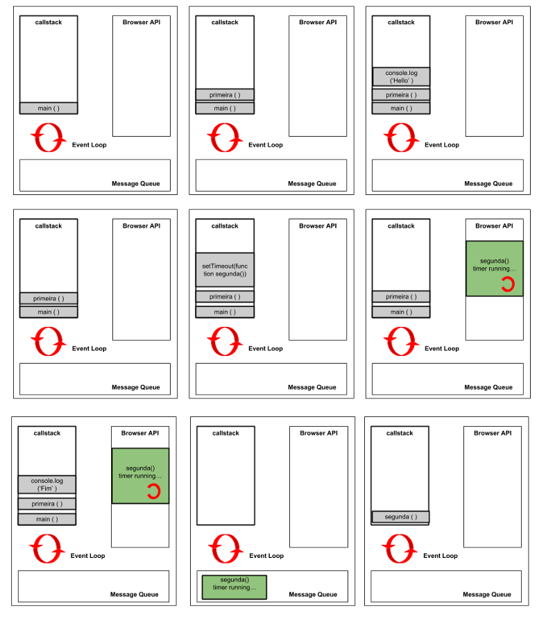

Olá pessoas incríveis da internet, eu prometi que não ia demorar e estou aqui novamente como sempre aprendendo e escrevendo para vocês.

Vocês já leram o post anterior? Falei sobre o fato do Javascript ser single-thread, mostrei como a pilha de chamada(CallStack) funciona e compreendemos um pouco como funciona o mecanismo Javascript, acredite, eu ficaria horas e horas falando sobre mas o intuito não é esse, chega de estender por aqui e quem quiser saber mais ta ai o link: [Você já se perguntou como o Javascript funciona? Call-Stack e visão geral do mecanismo.](https://medium.com/pequenos-passos-de-m%C3%A3os-dadas-comigo/voc%C3%AA-j%C3%A1-se-perguntou-como-o-javascript-funciona-call-stack-e-vis%C3%A3o-geral-do-mecanismo-c2b933f04b21)

O título já deu um pouco de spoiler do que vamos falar e eu vou começar pelo EventLoop, o que é isso?

Eu vou chamar uma telefonista para nos ajudar aqui, beleza?


Vamos chamar nossa telefonista de Dona Loop de Eventos, ela vai ficar monitorando a nossa pilha de chamadas e nossa fila de tarefas, quando ela ver que a pilha ta vazia e tem alguma coisa na fila, ela vai ser responsável por empurrar essa tarefa para a pilha executar.

Vamos pegar o seguinte código com funções síncronas:

```
function segunda(){
  console.log('Word')
}

function primeira(){
  console.log('Hello')
  segunda()
  console.log('Fim')
}

primeira()
```

Como ficaria a execução desse bloco de código na nossa pilha de chamada?



Observem a ordem de execução do nosso bloco de código, console.log() são funções executadas de forma rápida e colocadas imediatamente na pilha de chamadas por serem funções síncronas, vamos alterar nosso bloco de código inserindo uma função assíncrona setTimeout:

```
function primeira(){
  console.log('Hello')
  setTimeout(function segunda(){console.log('Word')}, 0)
  console.log('Fim')
}
```

Estavamos esperando que a saída nos retornasse Hello, Word e Fim, não foi o que aconteceu, por que?



Lembra que eu disse que setTimeout é uma função assíncrona? Todos os retornos de chamadas assíncronas não são executadas imediatamente, serão executadas um tempo depois e o responsável por isso é o EventLoop (ou nossa telefonista).

> “Alô senhor, é a Dona Loop de eventos e eu vou suspender a execução da segunda função por enquanto, mas continue na linha, assim que você terminar com as outras tarefas, eu retorno com essa função, certo?”

Vamos ver como ficaria a execução desse bloco de código:



Deu para entender como funciona o EventLoop? O loop dá prioridade para a pilha de chamadas e uma vez que não tem nada lá, busca se tem na fila de tarefas, mas a fila só tem essa responsabilidade? Não! A nossa fila de tarefas é onde ficam os eventos iniciados pelo usuário, funções que precisam ser executadas como é o nosso caso e também eventos do DOM como o onLoad.

> “Javascript só faz uma coisa por vez, tem chances de ter bloqueio se eu fizer uma função recursiva ou longa demais e pode ser que aconteça de não executar na ordem que eu quero, qual a vantagem, como lidar com esse EventLoop?”

Ter uma só responsabilidade tem suas limitações, que por sua vez pode ser útil, pois simplifica muito como se programa sem se preocupar com problemas de simultaneidade, é preciso prestar atenção em como se escreve o código, mas vou te ajudar com isso, eu não, o ECMAScript2015/ES6!

Nós não temos que ficar esperando por funções como setTimeout, porque atualmente conseguimos trabalhar com o conceito de Job Queue introduzido pelo ES6, esse conceito é usado por Promises. O que exatamente isso faz?

É sábado e você quer ir jogar fliperama, você chega no local e a responsável (fila de mensagem) te coloca no final da fila atrás de todas as pessoas, mas você foi esperto e comprou um cartão fastpass (fila de trabalho) que permite que você jogue outra vez logo após terminar a primeira partida. Usando essa analogia, conseguimos entender a importância das Promises, isso é javascript assíncrono.

Usando Javascript assíncrono nós temos a opção de executar solicitações longas sem bloquear a thread principal.

Alguém aqui já usou AJAX? AJAX por default é assíncrono, tanto que se setar async: false para nossa requisição vamos ter problemas, não façam isso em casa. Quem já usou sabe que na função de retorno (callback) é feito as operações embasadas no resultado que tivemos naquela requisição.

Agora usando Promises:

```
function soma(x, y){
  return Promise.all([x,y]).then(value => value[0] + value[1])
} //usando arrow function e escrevendo menos

soma(10,10).then(sum => console.log(sum))
```

Promises nos ajudam a trabalhar com código assíncrono de uma maneira muito mais organizada.

E Async/Await?

Se com Promise conseguimos escrever códigos assíncronos mais organizados, vocês precisam conhecer Async/Await e eu vou deixar aqui esse bônus, porém, vou aprofundar em outra postagem.

Primeiro, vou explicar como funciona, você define uma função usando async, essa função retorna um objeto AsyncFunction, quando essa função é executada ela retorna uma Promise, se em alguma parte dentro da função usamos o await para chamarmos outra Promise, ela vai pausar a execução da função, aguardar a resolução da Promise de dentro e em seguida retorna a execução, difícil? Vou deixar mais fácil:

```
async function logFetch() {
  try {
    const response = await fetch('http://example.api/endpoint1');
    console.log(await response.text());
  }
  catch (err) {
    console.log('fetch failed', err);
  }
}
```

Bom, por hoje é só, espero que tenham curtido passar esse tempo comigo e fiquem ligados nos próximos artigo.

Bye ❤
