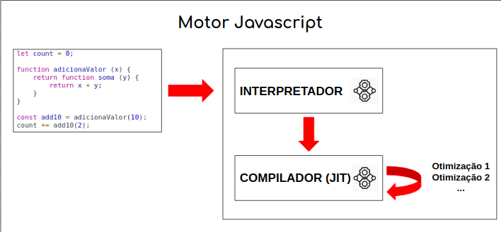
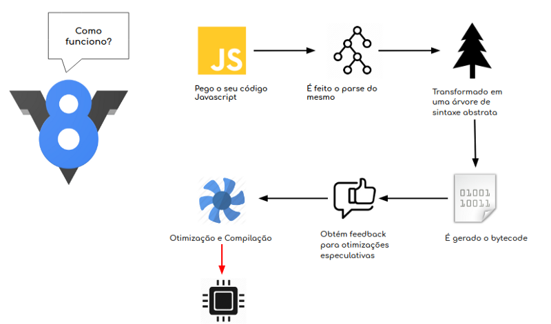

Olá pessoas incríveis da internet, nossa saga pelo mundo do Javascript continua e estou de volta para alegrar a vida de vocês:

Essa é nossa terceira parte de uma série de como o Javascript funciona, vai lá dar uma olhadinha nas outras:

-   [Você já se perguntou como o Javascript funciona? Call-Stack e visão geral do mecanismo.](https://medium.com/pequenos-passos-de-m%C3%A3os-dadas-comigo/voc%C3%AA-j%C3%A1-se-perguntou-como-o-javascript-funciona-call-stack-e-vis%C3%A3o-geral-do-mecanismo-c2b933f04b21)
-   [Você já se perguntou como o Javascript funciona? EventLoop, Filas e Programação Assíncrona](https://medium.com/pequenos-passos-de-m%C3%A3os-dadas-comigo/voc%C3%AA-j%C3%A1-se-perguntou-como-o-javascript-funciona-eventloop-filas-e-programa%C3%A7%C3%A3o-ass%C3%ADncrona-66aaf4552752)

Sem mais delongas, “Let’s put a smile on that face” e vamos lá!

Javascript é uma linguagem multi-paradigma e multi-plataforma, saber só da sintaxe não é saber exatamente como funciona.

Nos meus posts anteriores eu falei um pouco sobre call-stack, event loop, programação assíncrona e pausa para o primeiro quando eu disse sobre o mecanismo que é executado o Javascript e é sobre isso que vamos falar hoje, nossas engines ou motores porque aqui trabalhamos em PT-BR.

O que são esses motores? Ta filmando Netflix?

Antes de entrar nesse mundo vamos voltar naquela aula de programação que a professora falava sobre microprocessadores, não teve essa aula? não se lembra? Eu explico, o que permite que você esteja lendo isso é chamado de microprocessador, todos os nossos sistemas são microprocessadores que são pequenas máquinas que funcionam com sinais elétricos e fazem o que queremos, somos nós que fornecemos a esses carinhas as instruções e essas instruções estarão na linguagem que os microprocessadores processam.

O código escrito nessas linguagens são chamados código de máquina e para ser processado precisamos converter ou compilar esses códigos.

Mas nós trabalhamos com uma linguagem de alto nível que foi abstraída de uma linguagem de baixo nível, o C++, essas linguagens de baixo nível estão mais próximas do hardware se tornando mais rápidas, mas e o JS?

Voltamos aos nossos motores, eles são os programas responsáveis pela conversão do código Javascript em código de máquina ou nível inferior que os microprocessadores conseguem entender.

Existem diferentes mecanismos Javascript e cada grande fornecedor de navegador tem o seu, o Mozilla tem o SpiderMonkey, o Edge tem o Chakra, o Safari tem o JavascriptCore e o que é mais falado por ai, o senhor Chrome tem o V8 que também é o mecanismo do Node.js

Dentro desses motores existes exclusividades de cada um, porém todos precisam seguir as especificações do ECMAScript, e se o seu código utilizar de alguma variação de um motor especifico ele vai quebrar nos outros navegadores.

Um exemplo:

```
const fs = require('fs')

fs.rename('/tmp/hello', '/tmp/world', (err) => {

if (err) throw err

console.log('renomeado com sucesso!')

})
```

Se você executar esse código executado pelo Node.js no console ele não vai funcionar.

O primeiro motor que surgiu foi o SpiderMonkey, construído pela NetScape e era simplesmente um interpretador que lia e executava o código-fonte, porque na época o Javascript consistia em algumas funções escritas no cabeçalho de uma página web ou em alguns eventos inlines espalhados.

O lançamento do V8 em 2008 revolucionou a história dos motores e permitiu a ascensão do Node. Ele chegou para substituir a interpretação relativamente lenta do Javascript, porque ele combina a interpretação e compilação e atualmente todos os outros 4 motores usam essa técnica, onde o interpretador executa o código fonte de forma imediata e o compilador gera o código de máquina para ser processado.



Então vamos falar mais sobre nossa menina dos olhos!

### V8 como um carro, 8 cilindros

V8 é open-souce, escrito em C++ e utiliza vários segmentos para interpretar e compilar em JS, temos a thread principal que pega o código, compila e executa, uma thread separada para compilar de modo que a principal possa continuar executando enquanto o código está sendo otimizado, uma thread de profiler que diz ao tempo de execução quais os métodos gastaram mais tempo para que os compiladores possam otimiza-los e há alguns tópicos para lidar com coleta de lixo e eliminação de código morto.

Quando o V8 compila o código JS, o analisador gera uma árvore de sintaxe abstrata, o interpretador Ignition gera o bytecode desta árvore de sintaxe e o TurboFan, compilador e otimizador eventualmente pega o bytecode e gera em código de máquina otimizando a partir dele.



Então é isso senhoras e senhores, o intuito aqui é ser bem rápida e dinâmica, e dar os passos necessários para que possamos aprender um pouco mais sobre como funciona tudo por debaixo dos panos.

Quer saber mais sobre o V8? [https://v8.dev/](https://v8.dev/)

Quem gostou bate PALMAS, quem não gostou paciência ❤, feedback são bem vindos porque estamos aprendendo juntos! Até mais.
